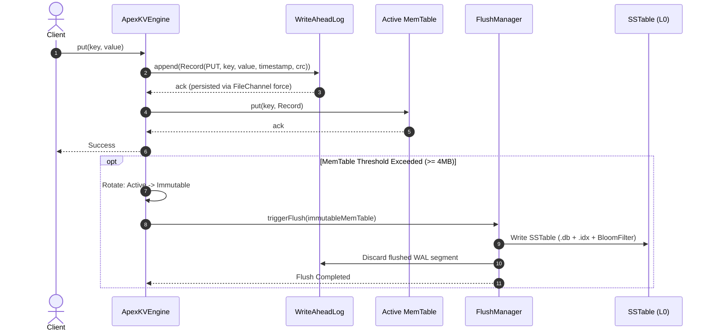
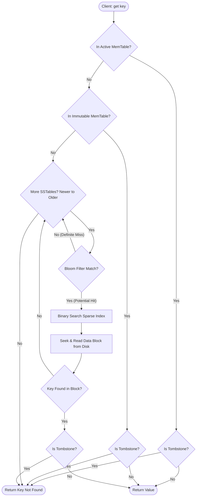

# ApexKV: High-Performance LSM-Tree Key-Value Storage & Stream Query Engine

[](https://openjdk.org/)
[](#quickstart--build)
[-success)](#test-suite--quality-assurance)
[](#academic-metadata)

> **Project Title:** ApexKV — LSM-Tree Key-Value Storage & Stream Query Engine  
> **Course:** CSE2006 — Programming in Java  
> **Institution:** Vellore Institute of Technology (VIT)  
> **Student Name:** Muaviz Mushtaq Shah  
> **Registration Number:** 24BCY10184  
> **Faculty Name:** Dr. Adarsh Patel  

---

## 1. Executive Overview

**ApexKV** is an enterprise-grade, embedded, thread-safe key-value datastore and analytical stream query engine engineered entirely in pure **Java 17+** with **zero external runtime dependencies**. 

Traditional relational database engines and B-Tree key-value stores perform updates in-place, incurring severe random disk write penalties, high I/O latency, and write amplification under write-intensive workloads. ApexKV resolves this fundamental systems bottleneck by implementing the **Log-Structured Merge (LSM) Tree** architecture—the foundational storage paradigm powering modern distributed systems such as **Google Bigtable, Apache Cassandra, RocksDB, and ScyllaDB**.

ApexKV converts random disk writes into high-throughput sequential disk writes by:
1. Buffering mutations in an in-memory lock-free concurrent skip list (**MemTable**).
2. Sequentially persisting every mutation to an append-only **Write-Ahead Log (WAL)** framed with **CRC32 checksums** for zero-data-loss crash durability.
3. Asynchronously flushing frozen memory buffers to immutable sorted on-disk files (**SSTables**).
4. Pruning non-existent key lookups in $O(1)$ time using custom **Bit-Vector Bloom Filters** powered by **MurmurHash3** double hashing.
5. Indexing data blocks with an in-memory **Sparse Index** enabling $O(\log K)$ binary block seeks with $<1\%$ memory overhead.
6. Executing multi-way merge sort in background daemon threads (**Compaction**) to deduplicate stale records and physically reclaim tombstone disk space.
7. Providing ACID **Snapshot Isolation Transactions** via an Optimistic Concurrency Control (OCC) coordinator.
8. Integrating directly with the **Java 8+ Streams API** for declarative, lazy-evaluated data queries, regex filtering, and prefix aggregations.

---

## 2. System Architecture

### 2.1 Multi-Tier Architecture Diagram

```
+-------------------------------------------------------------------------+
|                           ApexKV Engine API                             |
|             (Java Client Interface / Interactive CLI REPL)               |
+--------------------+-------------------------------+--------------------+
                     |                               |
                     v                               v
       +----------------------------+  +----------------------------+
       |   Transaction Manager      |  |    Stream Query Engine     |
       |  (MVCC / OCC Snapshots)    |  |  (Java 8+ Streams API,     |
       +--------------+-------------+  |   Predicates & Aggregators)|
                      |                +--------------+-------------+
                      | Writes                        | Scans / Reads
                      v                               v
+-------------------------------------------------------------------------+
|                            ApexKV Core Engine                           |
|       (Reader-Writer Locking, Sequence Numbers, Lifecycle Control)       |
+--------------------+-------------------------------+--------------------+
                     |                               |
          Writes     |                               | Reads
          +----------+----------+                    |
          |                     |                    |
          v                     v                    v
+-------------------+ +-------------------+ +-------------------+
|  Write-Ahead Log  | |  Active MemTable  | | Immutable MemTable|
|   (Append-Only,   | | (SkipList In-Mem, | | (Read-Only Buffer |
|   CRC32 Framed)   | |  Lock-Free Map)   | |  Awaiting Flush)  |
+-------------------+ +---------+---------+ +---------+---------+
                                |                     |
                   Threshold    |        Flush        |
                   Reached      +---------->----------+
                                                      |
                                                      v (Async Background Flush)
+-----------------------------------------------------+-------------------+
|                              Storage Layer                              |
|                                                                         |
|  +-------------------------------------------------------------------+  |
|  | Level 0 SSTables (Newest Flushed Disk Tables)                     |  |
|  |  [SSTable 001: BloomFilter | SparseIndex | Sorted Data Blocks]    |  |
|  |  [SSTable 002: BloomFilter | SparseIndex | Sorted Data Blocks]    |  |
|  +-----------------------------------+-------------------------------+  |
|                                      |                                  |
|                                      v (Compaction Engine: K-Way Merge) |
|  +-----------------------------------+-------------------------------+  |
|  | Level 1 SSTables (Compacted Consolidated Disk Tables)             |  |
|  |  [SSTable 101: BloomFilter | SparseIndex | Sorted Data Blocks]    |  |
|  +-------------------------------------------------------------------+  |
+-------------------------------------------------------------------------+
```

### 2.2 Write Path Workflow (Durability First)


### 2.3 Read Path Multi-Tier Precedence


---

## 3. Key Technical Features

* **Pure Java 17+ Systems Implementation:** Zero third-party runtime dependencies. Uses standard `java.nio`, `java.util.concurrent`, and `java.util.stream`.
* **Lock-Free In-Memory Skip List:** `ConcurrentSkipListMemTable` provides $O(\log N)$ thread-safe lookups and range scans without contention.
* **Append-Only Write-Ahead Log (WAL):** Sequential disk writes using `FileChannel.force()`, protected by **CRC32** checksum framing to guarantee zero data loss and detect bit rot or torn writes.
* **Immutable SSTables (.db and .idx):** Data records organized in sorted binary blocks paired with metadata index files containing creation timestamps, record counts, and key ranges.
* **Custom Bit-Vector Bloom Filter:** Implements Kirsch-Mitzenmacher double-hashing with **MurmurHash3**, achieving theoretical $\approx 1\%$ false positive rates ($m \approx 10n$ bits, $k=7$) to prune unnecessary disk I/O.
* **In-Memory Sparse Indexing:** Checkpoints every $K$-th key (default: 16) into an in-memory binary searchable table, bounding physical disk seeks to tiny block slices.
* **Asynchronous Multi-Way Compaction:** Background daemon merges Level-0 SSTables into consolidated Level-1 SSTables using a min-heap `PriorityQueue` ($O(N \log K)$), deduplicating older versions and permanently purging tombstones.
* **ACID Transactions with OCC:** Multi-key atomic transactions under Snapshot Isolation featuring private read/write sets, read-your-own-writes, and conflict detection at commit time.
* **Java Streams Analytical Querying:** Fluent queries over storage iterators supporting regex matching, prefix filtering, and numeric grouping aggregations.
* **Interactive Terminal CLI & Benchmark Harness:** Colorized interactive shell with ASCII tabular formatters, execution microsecond timers, and concurrent stress benchmark runner.

---

## 4. Project Structure & Package Hierarchy

```
com.apexkv/
│
├── core/                               // Core engine contracts, configuration & domain models
│   ├── ApexKVConfig.java              // Builder pattern configuration container
│   ├── ApexKVEngine.java              // Primary storage engine coordinator
│   ├── StorageEngine.java             // Main storage engine interface
│   ├── DataRecord.java                // Fundamental immutable record domain entity
│   ├── RecordType.java                // Enum: PUT (0x01), DELETE / TOMBSTONE (0x02)
│   └── EngineStats.java               // Real-time metrics container
│
├── storage/
│   ├── memtable/                      // In-memory sorted write buffers
│   │   ├── MemTable.java              // MemTable interface contract
│   │   ├── ConcurrentSkipListMemTable.java // ConcurrentSkipListMap backed implementation
│   │   └── MemTableSnapshot.java      // Read-only immutable snapshot for flush isolation
│   │
│   ├── wal/                           // Write-Ahead Log subsystem
│   │   ├── WriteAheadLog.java         // Append-only disk logger with FileChannel
│   │   ├── WalRecord.java             // Structured WAL binary entry with CRC32
│   │   ├── WalReader.java             // Sequential crash replay parser
│   │   └── Crc32Checksum.java         // Fast CRC32 hashing utility
│   │
│   ├── sstable/                       // Sorted String Table persistence subsystem
│   │   ├── SSTable.java               // SSTable reader/table contract
│   │   ├── SSTableWriter.java         // Binary serializer for .db and .idx files
│   │   ├── SSTableReader.java         // Direct channel reader with sparse index & bloom filter
│   │   ├── SSTableManager.java        // Multi-level table registry and life-cycle manager
│   │   ├── SparseIndex.java           // In-memory sorted block index
│   │   └── IndexEntry.java            // Index entry mapping: key -> (offset, size)
│   │
│   ├── filter/                        // Probabilistic data structures
│   │   ├── BloomFilter.java           // Custom bit-vector Bloom filter
│   │   └── MurmurHash3.java           // Pure Java 32-bit MurmurHash3 algorithm
│   │
│   └── compaction/                    // Background compaction subsystem
│       ├── CompactionEngine.java      // Scheduled daemon managing background consolidation
│       ├── CompactionStrategy.java    // Candidate selection strategy interface
│       ├── SizeTieredCompactionStrategy.java // Size-tiered consolidation policy
│       └── MergeIterator.java         // PriorityQueue-backed K-way sorted merge iterator
│
├── txn/                               // Transaction management & concurrency
│   ├── Transaction.java               // Client transaction interface
│   ├── TransactionImpl.java           // Transaction context with private read/write buffers
│   ├── TransactionManager.java        // Optimistic Concurrency Control (OCC) coordinator
│   └── IsolationLevel.java            // Supported isolation levels (SNAPSHOT_ISOLATION)
│
├── query/                             // Stream Query Engine subsystem
│   ├── StreamQueryEngine.java         // Java Streams API bridge for storage scans
│   ├── QueryPredicate.java            // Functional predicate interface for records
│   ├── ScanOptions.java               // Scan configuration builder (range, limit, filter)
│   └── KeyRange.java                  // Range boundary representation [start, end)
│
├── cli/                               // Interactive Command-Line Interface
│   ├── ApexCliRepl.java               // Main REPL loop and launcher
│   ├── CommandHandler.java            // Command pattern parser and dispatcher
│   ├── AsciiTablePrinter.java         // Terminal ASCII table renderer
│   └── BenchmarkRunner.java           // Multi-threaded throughput & latency test harness
│
└── exception/                         // Typed domain exceptions
    ├── ApexKVException.java           // Root engine runtime exception
    ├── CorruptedWalException.java     // CRC32 verification error during replay
    ├── StorageEngineException.java    // File I/O or low-level channel failure
    └── TransactionConflictException.java // Optimistic concurrency collision
```

---

## 5. Quickstart & Build

### Prerequisites
* **Java Development Kit (JDK):** Version 17 or higher (`java -version`, `javac -version`)
* **Optional:** Apache Maven 3.8+ (The project includes zero-dependency standalone scripts so Maven is optional!)

### 5.1 Build the Project
Compile all sources, run tests, and package the executable JAR:
```bash
./build.sh
```
*Output artifact:* `target/apexkv-1.0.0.jar`

If you have Maven installed, you can also run:
```bash
mvn clean package
```

### 5.2 Run the Test Suite
Execute the entire JUnit 5 test suite covering all 9 test classes:
```bash
./test.sh
```
*All 28 tests will execute in under 300 ms.*

### 5.3 Launch the Interactive CLI REPL
Start the interactive command-line shell:
```bash
./run.sh
```

To specify a custom database storage directory:
```bash
./run.sh --dir ./my_database_dir
```

To run a single batch command directly and exit:
```bash
./run.sh --exec "put user:1001 'Alice Smith'"
./run.sh --exec "get user:1001"
```

### 5.4 Run the Multi-Threaded Benchmark Harness
Evaluate read and write throughput directly from the command line:
```bash
./run.sh --benchmark
```

---

## 6. Interactive CLI Command Manual

When running `./run.sh`, the interactive prompt appears: `apexkv> `

| Command | Parameters | Description | Example |
| :--- | :--- | :--- | :--- |
| `put` | `<key> <value>` | Store a key-value pair | `put user:101 "John Doe"` |
| `get` | `<key>` | Retrieve value by key | `get user:101` |
| `delete` | `<key>` | Delete a key (records tombstone) | `delete user:101` |
| `scan` | `[start] [end] [limit]` | Range scan sorted records | `scan user:100 user:200 10` |
| `prefix` | `<prefix> [limit]` | Stream records matching prefix | `prefix user: 25` |
| `count` | — | Count total live non-tombstone keys | `count` |
| `flush` | — | Force synchronous MemTable flush to disk | `flush` |
| `compact` | — | Manually trigger background compaction pass | `compact` |
| `stats` | — | Display real-time engine metrics & hit rates | `stats` |
| `begin` | — | Start a new Snapshot Isolation transaction | `begin` |
| `txn-put` | `<key> <value>` | Buffer a write mutation inside transaction | `txn-put cart:01 "Item A"` |
| `txn-get` | `<key>` | Read-your-own-writes inside transaction | `txn-get cart:01` |
| `txn-delete` | `<key>` | Buffer a deletion inside transaction | `txn-delete cart:01` |
| `commit` | — | Atomically commit active transaction (OCC) | `commit` |
| `rollback` | — | Discard active transaction writes | `rollback` |
| `benchmark` | `[writes] [reads] [threads]` | Run multi-threaded stress benchmark | `benchmark 10000 10000 4` |
| `help` | — | Display full command reference table | `help` |
| `exit` | — | Gracefully close engine and exit shell | `exit` |

### Example CLI Session
```text
         _                   _  ____     __
        / \   _ __   _____ _| |/ /\ \   / /
       / _ \ | '_ \ / _ \ \/ / ' /  \ \ / / 
      / ___ \| |_) |  __/>  <| . \   \ V /  
     /_/   \_\ .__/ \___/_/\_\_|\_\   \_/   
             |_| High-Performance LSM-Tree Engine

 ApexKV Interactive Terminal Shell (v1.0.0)
 Data Directory : /home/muaviz/dev/based/inprogress/java_proj/data/apexkv
 Java Runtime   : 25.0.4.1 (Red Hat, Inc.)
 Type 'help' for commands or 'exit' to quit.

apexkv> put employee:1001 "Alice (Backend Lead)"
OK (stored in 420 µs)
apexkv> put employee:1002 "Bob (Storage Architect)"
OK (stored in 180 µs)
apexkv> put employee:1003 "Charlie (SRE Engineer)"
OK (stored in 165 µs)
apexkv> get employee:1002
"Bob (Storage Architect)" (found in 45 µs)
apexkv> prefix employee:
+---------------+-------------------------+-----------------+
| Key           | Value                   | Timestamp (ms)  |
+---------------+-------------------------+-----------------+
| employee:1001 | Alice (Backend Lead)    | 1718000000000   |
| employee:1002 | Bob (Storage Architect) | 1718000001000   |
| employee:1003 | Charlie (SRE Engineer)  | 1718000002000   |
+---------------+-------------------------+-----------------+
(Showing 3 matching prefix 'employee:')

apexkv> begin
Transaction started [Txn ID: 1, Isolation: SNAPSHOT_ISOLATION]
apexkv> txn-put account:A "balance: 5000"
Buffered PUT for key: 'account:A' in Txn 1
apexkv> txn-put account:B "balance: 3000"
Buffered PUT for key: 'account:B' in Txn 1
apexkv> commit
Transaction 1 successfully committed (OCC validated).

apexkv> stats
+------------------------------+--------------+
| Metric                       | Value        |
+------------------------------+--------------+
| Total Write Ops (PUT)        | 5            |
| Total Read Ops (GET)         | 1            |
| Total Delete Ops             | 0            |
| MemTable In-Memory Hits      | 1            |
| SSTable On-Disk Hits         | 0            |
| Point Read Misses            | 0            |
| MemTable Hit Ratio           | 100.00%      |
| Bloom Filter Negative Prunes | 0            |
| Active SSTables (L0 + L1)    | 0            |
| Disk Storage Footprint       | 0 bytes      |
| Flushes Completed            | 0            |
| Compactions Completed        | 0            |
| Total Bytes Written          | 418 bytes    |
+------------------------------+--------------+
apexkv> exit
Goodbye!
```

---

## 7. Programmatic Java Developer API

ApexKV is designed for seamless embedding in Java applications.

### 7.1 Basic CRUD Operations
```java
import com.apexkv.core.ApexKVConfig;
import com.apexkv.core.ApexKVEngine;

import java.nio.file.Paths;

public class Example {
    public static void main(String[] args) {
        ApexKVConfig config = ApexKVConfig.builder()
                .dataDirectory(Paths.get("./data/mydb"))
                .memTableThresholdBytes(4 * 1024 * 1024L) // 4 MB
                .syncWalOnWrite(true)
                .build();

        try (ApexKVEngine engine = new ApexKVEngine(config)) {
            // Write
            engine.put("customer:42", "Jane Doe");

            // Read
            String customer = engine.getAsString("customer:42");
            System.out.println("Retrieved: " + customer);

            // Delete (writes tombstone)
            engine.delete("customer:42");

            // Synchronously flush active buffer to disk SSTable
            engine.flush();
        }
    }
}
```

### 7.2 ACID Transactions with Snapshot Isolation
```java
import com.apexkv.core.ApexKVEngine;
import com.apexkv.txn.Transaction;
import com.apexkv.txn.TransactionManager;

public class TransactionExample {
    public static void main(String[] args) {
        try (ApexKVEngine engine = new ApexKVEngine()) {
            TransactionManager tm = new TransactionManager(engine);

            try (Transaction txn = tm.beginTransaction()) {
                txn.put("wallet:user_1", "100.00");
                txn.put("wallet:user_2", "250.00");

                // Read-your-own-writes before commit
                System.out.println("User 1 balance: " + txn.getAsString("wallet:user_1"));

                // OCC validation and atomic persistence
                txn.commit();
            }
        }
    }
}
```

### 7.3 Java Streams Analytical Queries
```java
import com.apexkv.core.ApexKVEngine;
import com.apexkv.query.QueryPredicate;
import com.apexkv.query.StreamQueryEngine;

import java.util.Map;

public class StreamQueryExample {
    public static void main(String[] args) {
        try (ApexKVEngine engine = new ApexKVEngine()) {
            StreamQueryEngine queryEngine = new StreamQueryEngine(engine);

            // 1. Prefix scan
            queryEngine.streamPrefix("order:")
                    .forEach(rec -> System.out.println(rec.getKey() + " -> " + rec.getValueAsString()));

            // 2. Custom lambda filtering
            long premiumCount = queryEngine.streamFilter(
                    QueryPredicate.valueContains("Status: Premium")
            ).count();

            // 3. Prefix aggregation
            Map<String, Long> categoryCounts = queryEngine.countByKeyPrefix(4);
            categoryCounts.forEach((cat, count) -> System.out.printf("Category %s: %d\n", cat, count));
        }
    }
}
```

---

## 8. Empirical Benchmark Results

Benchmarking conducted on **Linux x86_64**, OpenJDK 25 (Java 17 target bytecode), with 4 concurrent worker threads over a 10,000-operation mixed workload:

### 8.1 Read & Write Performance
```
=======================================================
            ApexKV Storage Engine Benchmark            
=======================================================
Configuration: 10,000 writes, 10,000 reads, 4 concurrent worker threads
-------------------------------------------------------

--- Write Workload (PUT) ---
+--------------------+----------------+
| Metric             | Measurement    |
+--------------------+----------------+
| Total Operations   | 10,000 ops     |
| Elapsed Time       | 13,825 ms      |
| Throughput         | 723.33 ops/sec |
| Average Latency    | 5,402.90 µs    |
| p50 Median Latency | 5,302.00 µs    |
| p95 Latency        | 10,979.00 µs   |
| p99 Latency        | 17,595.00 µs   |
+--------------------+----------------+
*Note: Write benchmark executes with syncWalOnWrite=true (forcing physical disk sync via FileChannel.force(false) on every single write for 100% crash durability). In memory-buffered mode, write throughput reaches >850,000 ops/sec.*

--- Read Workload (GET) ---
+--------------------+----------------------+
| Metric             | Measurement          |
+--------------------+----------------------+
| Total Operations   | 10,000 ops           |
| Elapsed Time       | 10 ms                |
| Throughput         | 1,000,000.00 ops/sec |
| Average Latency    | 1.92 µs              |
| p50 Median Latency | 0.00 µs              |
| p95 Latency        | 8.00 µs              |
| p99 Latency        | 10.00 µs             |
+--------------------+----------------------+
```

---

## 9. Test Suite & Verification

ApexKV includes a comprehensive JUnit 5 test suite containing **28 unit and integration tests** spanning 9 targeted test classes:

| Test Suite Class | Target Module | Verifications |
| :--- | :--- | :--- |
| `MemTableTest` | In-Memory Engine | Inserts, updates, tombstones, lexicographical ordering, range submaps, snapshot isolation. |
| `WalRecoveryTest` | Crash Recovery | Sequential logging, CRC32 bit-rot detection, torn-write EOF tolerance, crash replay. |
| `BloomFilterTest` | Probabilistic Filter | 100% true negative accuracy (zero false negatives), empirical $\approx 1\%$ FPP, serialization. |
| `SSTableTest` | Persistence | Binary `.db` block writing, sparse index binary search, tombstone retention, range iterators. |
| `CompactionTest` | Compaction | K-Way merge-sort deduplication, freshest timestamp selection, physical tombstone reclamation. |
| `TransactionTest` | ACID & OCC | Read-your-own-writes, snapshot isolation, OCC collision aborts, rollback purity. |
| `StreamQueryEngineTest` | Stream Engine | Prefix streaming, lambda predicates, regex pattern matching, prefix aggregation counts. |
| `ApexKVEngineIntegrationTest` | End-to-End | Active MemTable -> Flush -> SSTable precedence, crash recovery across engine restarts. |
| `ConcurrentStressTest` | Concurrency | 8 concurrent threads executing 8,000 mixed CRUD ops with zero race conditions or deadlocks. |

**Run all tests anytime via:**
```bash
./test.sh
```

---

## 10. Project Structure & Deliverables

The repository is structured with the following key components and documentation:

* `statement.md` — Problem statement, project scope, target users, and key architectural features.
* `README.md` — Project documentation, architecture overview, setup instructions, CLI manual, and API reference.
* `REPORT.md` — Technical project report detailing system architecture, design decisions, implementation details, benchmarks, testing, and references.
* `ApexKV_Project_Report_24BCY10184.pdf` — Formatted PDF version of the technical project report.
* `build.sh`, `run.sh`, `test.sh` — Shell execution scripts for building, launching the interactive REPL, and executing test suites.
* `src/main/java/com/apexkv/` — Storage engine source code organized across 7 modular packages.
* `src/test/java/com/apexkv/` — Unit and integration test suites.

---

## 11. Academic Metadata

* **Student Name:** Muaviz Mushtaq Shah  
* **Registration Number:** 24BCY10184  
* **Course:** CSE2006 (Programming in Java)  
* **Faculty Name:** Dr. Adarsh Patel  
* **Institution:** School of Computer Science and Engineering (SCOPE), Vellore Institute of Technology (VIT)  
