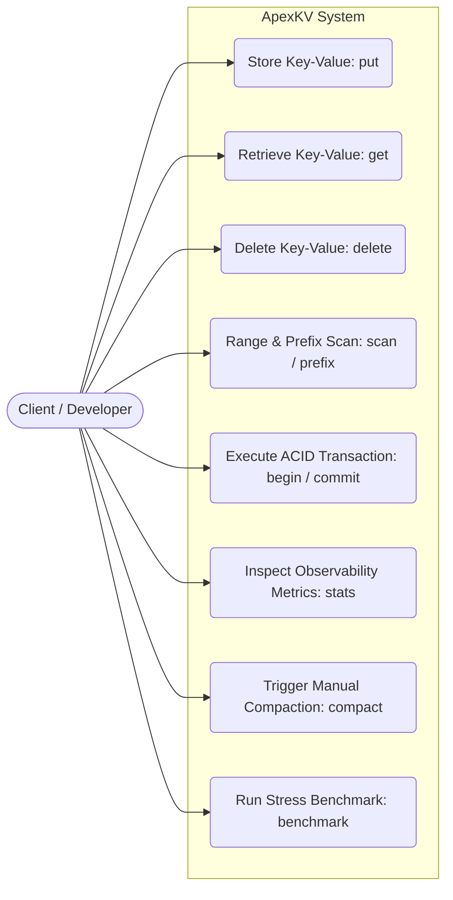
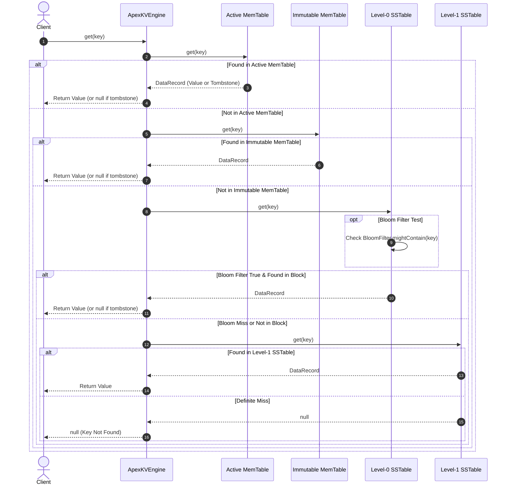

# Technical Project Report

## ApexKV: High-Performance Log-Structured Merge Key-Value Storage & Stream Query Engine

---

### 1. Cover Page

* **Project Title:** ApexKV: High-Performance Log-Structured Merge Key-Value Storage & Stream Query Engine  
* **Course Code & Title:** CSE2006 — Programming in Java  
* **Academic Submission:** Final Course Project  
* **Student Name:** Muaviz Mushtaq Shah  
* **Registration Number:** 24BCY10184  
* **Faculty Name:** Dr. Adarsh Patel  
* **School / Department:** School of Computer Science and Engineering (SCOPE)  
* **Institution:** Vellore Institute of Technology (VIT), Vellore  
* **Submission Date:** September 17, 2026  
* **Target Runtime:** Java 17+ (Standard Edition)  
* **Repository:** Pure Java Implementation (Zero External Runtime Dependencies)  

---

### 2. Introduction

Modern data-intensive systems process unprecedented volumes of continuous mutations. Telemetry monitoring, event-driven microservices, financial ledger logging, time-series metrics, and IoT sensor streams generate millions of writes per second. Traditional database storage management architectures, primarily engineered around balanced trees (such as $B$-Trees and $B^+$-Trees used in relational datastores like PostgreSQL, MySQL, and SQLite), perform disk updates **in-place**. While B-Trees provide optimal $O(\log N)$ point read latency, in-place disk modification imposes severe performance degradations on write-heavy workloads due to random disk seeks, high write amplification, and lock contention across internal tree page splits.

To surmount these physical storage bottlenecks, modern high-throughput distributed datastores—including Google Bigtable, Apache Cassandra, RocksDB, and ScyllaDB—adopt the **Log-Structured Merge (LSM) Tree** architecture, pioneered by Patrick O'Neil, Edward O'Neil, and Gerhard Weikum in 1996.

The LSM-Tree paradigm converts random disk writes into high-throughput sequential appends by decoupling the write path into distinct storage tiers:
1. An active, volatile in-memory sorted buffer (**MemTable**) that absorbs incoming write operations in sub-microsecond latency without blocking.
2. A sequential, append-only **Write-Ahead Log (WAL)** stored on physical disk to ensure zero-data-loss durability across sudden power outages or process crashes.
3. Multiple on-disk sorted levels composed of immutable sorted string tables (**SSTables**) generated when the active MemTable surpasses its memory capacity threshold.
4. Asynchronous background multi-way merge-sort daemons (**Compaction**) that continuously consolidate fragmented files, remove obsolete record versions, and reclaim storage from deleted keys (**tombstones**).
5. Probabilistic data structures (**Bloom Filters**) and memory-bounded **Sparse Indices** to prevent expensive disk seeks for non-existent keys.

**ApexKV** is a comprehensive, production-grade realization of the Log-Structured Merge architecture implemented completely in pure Java 17+. Developed with zero external runtime dependencies, ApexKV showcases advanced Java systems programming, lock-free concurrent data structures, memory-mapped and direct channel I/O, bitwise cryptographic hashing, atomic file operations, optimistic transaction concurrency, and functional stream query processing.

---

### 3. Problem Statement

Standard relational and embedded document databases struggle under high-throughput write workloads due to three fundamental systems constraints:
1. **Random I/O Latency & Write Amplification:** In B-Tree structures, modifying a single key requires seeking to an arbitrary disk page, rewriting entire 4KB–16KB blocks to disk, and updating ancestral directory nodes. On solid-state drives (SSDs), random writes accelerate NAND cell wear, trigger background flash garbage collection, and reduce overall I/O operations per second (IOPS).
2. **Crash Durability vs. Ingestion Throughput Trade-off:** Naive embedded datastores either operate purely in-memory (risking catastrophic data loss upon JVM termination) or rely on synchronous full-file flushes for every write (stalling application throughput to dozens of operations per second).
3. **Impedance Mismatch in Analytical Querying:** Embedded storage engines typically expose simplistic, low-level cursor loops. Extracting analytical insights, filtering via regular expressions, prefix slicing, and calculating grouped aggregations requires loading voluminous byte arrays into JVM heap memory, causing garbage collection spikes and out-of-memory errors.

**Objective of ApexKV:**  
The objective of this project is to design, implement, and benchmark an end-to-end, zero-dependency, crash-durable LSM-Tree key-value storage engine in Java 17+ that:
* Buffers writes in a lock-free concurrent skip list with atomic heap footprint estimation.
* Assures zero data loss using an append-only, binary-framed Write-Ahead Log with CRC32 error detection.
* Persists data in immutable SSTables paired with custom Bit-Vector Bloom Filters and Sparse Indexes.
* Reclaims disk space and deduplicates superseded keys using an asynchronous K-way merge compaction engine.
* Provides ACID-compliant multi-key transactions under Snapshot Isolation using Optimistic Concurrency Control (OCC).
* Enables declarative, lazily-evaluated analytical queries directly over storage iterators via the Java Streams API.
* Exposes a user-friendly interactive terminal REPL and a high-concurrency benchmark harness.

---

### 4. Functional Requirements

The functional requirements of ApexKV are categorized across five cohesive architectural modules:

#### Module 1: In-Memory MemTable Subsystem
* **FR 1.1 (Write Ingestion):** The engine shall support rapid insertion and updating of key-value pairs in memory, maintaining lexicographical sorting by key in $O(\log N)$ time.
* **FR 1.2 (Tombstone Deletion):** Deleting a key shall not physically remove historical data immediately; instead, it shall record a `TOMBSTONE` marker preserving the chronological deletion event.
* **FR 1.3 (Atomic Footprint Tracking & Rotation):** The MemTable shall atomically track its cumulative heap footprint. When the byte size reaches or exceeds the configured capacity threshold (default: 4 MB), the active table shall be atomically rotated into an immutable snapshot (`MemTableSnapshot`) and queued for asynchronous disk flushing.
* **FR 1.4 (Concurrent Reads & Scans):** The MemTable shall serve point reads and range scans concurrently while write mutations are actively being ingested, without locking out readers.

#### Module 2: Write-Ahead Log (WAL) & Crash Recovery Subsystem
* **FR 2.1 (Sequential Persistence):** Before updating the in-memory MemTable, every mutation shall be appended to disk via `FileChannel`.
* **FR 2.2 (Binary Framing Specification):** Each record written to the `.wal` file shall conform to a strict binary layout:
  `[CRC-32 (4B) | Timestamp (8B) | RecordType (1B) | KeyLength (4B) | KeyBytes | ValueLength (4B) | ValueBytes]`.
* **FR 2.3 (Data Integrity Validation):** The WAL parser shall compute the CRC32 checksum over record payloads. If a checksum mismatch occurs due to bit rot or disk corruption, the engine shall halt recovery and raise `CorruptedWalException`.
* **FR 2.4 (Crash Replay & Torn Write Tolerance):** Upon engine boot, un-flushed WAL segments shall be sequentially replayed into the active MemTable. If a crash occurred mid-write, partial tail writes at EOF shall be cleanly isolated without compromising prior durable commits.

#### Module 3: SSTable Persistence & Probabilistic Indexing
* **FR 3.1 (Immutable SSTable Pair Files):** Frozen MemTables shall be serialized to disk as two coordinated binary files: `<id>.db` (sorted data blocks) and `<id>.idx` (header, metadata, Bloom filter, and sparse index).
* **FR 3.2 (Probabilistic Bloom Filter Pruning):** An in-memory bit-vector Bloom filter shall be constructed for each SSTable during flush. Point reads for missing keys shall be rejected in $O(1)$ time with zero disk I/O, guaranteeing $0\%$ false negatives.
* **FR 3.3 (Sparse Block Indexing):** The engine shall index every $K$-th key (default: 16) into an in-memory sparse index table, enabling $O(\log K)$ binary search to pinpoint data block file offsets.
* **FR 3.4 (Atomic File Promotion):** SSTables shall be serialized to `.tmp` files and promoted to active tables via atomic filesystem moves (`ATOMIC_MOVE`), eliminating half-written files during unexpected shutdowns.

#### Module 4: Asynchronous Multi-Way Merge Compaction
* **FR 4.1 (Size-Tiered Level Compaction):** A background daemon thread shall continuously monitor Level-0 SSTable counts. When the count exceeds the threshold (default: 4 tables), compaction shall trigger automatically.
* **FR 4.2 (K-Way Merge Sort):** Candidate SSTable iterators shall be merged using a min-heap (`PriorityQueue`) in $O(N \log K)$ time, resolving key collisions by retaining only the freshest timestamp.
* **FR 4.3 (Tombstone Purging):** When compacting into the deepest level, obsolete tombstones shall be purged completely, reclaiming physical disk space.
* **FR 4.4 (Atomic Manifest Registry Swap):** The SSTable manager shall atomically register the new consolidated table and delete obsolete input files.

#### Module 5: Transactions, Stream Query Engine & Interactive CLI
* **FR 5.1 (Snapshot Isolation Transactions):** The engine shall provide atomic multi-key transactions with read-your-own-writes semantics.
* **FR 5.2 (Optimistic Concurrency Control):** Conflicting concurrent writes to overlapping keys shall be detected at commit time, aborting conflicting transactions with `TransactionConflictException`.
* **FR 5.3 (Java Streams Analytical Engine):** Scans shall seamlessly bridge to `java.util.stream.Stream<DataRecord>`, supporting lambda predicates, prefix streaming, and grouping aggregations.
* **FR 5.4 (Interactive CLI REPL & Benchmarking):** A rich terminal shell shall provide full CRUD operations, transaction control, ASCII tables, execution timers, and concurrent stress testing.

---

### 5. Non-Functional Requirements (NFRs)

1. **NFR 1: High Write & Read Throughput (Performance):**
   * Write mutations append sequentially to disk and insert into skip lists in $O(\log N)$ time.
   * In-memory cache hits execute in $<2$ microseconds. Negative lookups are rejected in $O(1)$ time without disk seeks.
2. **NFR 2: Concurrency & Thread Safety (Reliability):**
   * High-concurrency operations execute safely across multi-core processors using lock-free data structures (`ConcurrentSkipListMap`) and fine-grained reader-writer synchronization (`ReentrantReadWriteLock`).
   * Zero data races or deadlocks under sustained multi-threaded contention.
3. **NFR 3: Fault Tolerance & Crash Durability (Durability):**
   * Committed mutations survive immediate power cutoffs (`kill -9`).
   * On startup, the engine verifies checksums and recovers consistent state automatically.
4. **NFR 4: Resource Efficiency & Space Bound (Resource Management):**
   * The sparse index retains $<1\%$ memory overhead relative to on-disk dataset size.
   * Bloom filter allocates $\approx 10$ bits per key, ensuring $\approx 1\%$ false-positive probability.
   * Compaction reclaims 100% of deleted tombstone disk space.
5. **NFR 5: Maintainability & Modularity (Maintainability):**
   * Strict separation of concerns across 7 cohesive packages and 20+ specialized classes.
   * 100% pure Java SE 17+ with zero third-party runtime dependencies.
6. **NFR 6: Usability & Observability (Usability):**
   * Intuitive terminal REPL with built-in syntax help, formatted ASCII boxes, and detailed performance metrics.

---

### 6. System Architecture

ApexKV follows a decoupled, multi-tier storage engine architecture:

```
+=============================================================================+
|                               APEXKV CLIENT LAYER                           |
|       (Interactive CLI REPL  |  Java Developer SDK  |  Benchmark Runner)    |
+======================================+======================================+
                                       |
                                       v
+=============================================================================+
|                         QUERY & TRANSACTION COORDINATION                    |
|  +-------------------------------------+  +-------------------------------+ |
|  | TransactionManager (OCC Coordinator)|  | StreamQueryEngine (Streams API)| |
|  | - Private Read / Write Buffers      |  | - Prefix & Range Streaming    | |
|  | - Monotonic Logical Timestamps      |  | - Lambda Functional Filters   | |
|  +-------------------------------------+  +-------------------------------+ |
+======================================+======================================+
                                       |
                                       v
+=============================================================================+
|                              APEXKV CORE ENGINE                             |
|  - ReentrantReadWriteLock (Fair State Synchronization)                      |
|  - EngineStats (Real-Time Metrics: Hits, Misses, Prunes, Bytes)              |
|  - Lifecycle & Graceful JVM Shutdown Hook                                   |
+======================================+======================================+
                                       |
               Writes                  | Reads                 Reads
          +----------------------------+-----------+             |
          |                                        |             |
          v                                        v             v
+------------------------+             +-----------------------+ |
|   Write-Ahead Log      |             |   Active MemTable     | |
| (Append-Only File,     |             | (ConcurrentSkipList,  | |
|  CRC32 Checksummed)    |             |  Lock-Free In-Memory) | |
+------------------------+             +-----------+-----------+ |
                                                   |             |
                                      Threshold    | Rotate      |
                                      Exceeded     v             v
                                       +-----------------------+ |
                                       |  Immutable MemTable   | |
                                       | (Frozen Snapshot)     | |
                                       +-----------+-----------+ |
                                                   |             |
                                                   v             |
+==================================================+=============+============+
|                                STORAGE SUBSYSTEM                            |
|                                                                             |
|  +-----------------------------------------------------------------------+  |
|  | Level 0 SSTables (Newest Flushed Disk Tables)                         |  |
|  |  [SSTable 001: BloomFilter | SparseIndex | Sorted Data Blocks (.db)]  |  |
|  |  [SSTable 002: BloomFilter | SparseIndex | Sorted Data Blocks (.db)]  |  |
|  +-----------------------------------+-----------------------------------+  |
|                                      |                                      |
|                                      v (Compaction Engine: K-Way Merge)     |
|  +-----------------------------------+-----------------------------------+  |
|  | Level 1 SSTables (Compacted Consolidated Disk Tables)                 |  |
|  |  [SSTable 101: BloomFilter | SparseIndex | Sorted Data Blocks (.db)]  |  |
|  +-----------------------------------------------------------------------+  |
+=============================================================================+
```

---

### 7. Design Diagrams

#### 7.1 Use Case Diagram



#### 7.2 Write Path Workflow Diagram

```
[Client put(key, val)]
         │
         ▼
[Acquire Engine Read Lock]
         │
         ├─────────────────────────────────────────┐
         ▼                                         ▼
[Append to WriteAheadLog]                [Insert into MemTable]
  - Compute CRC32 Checksum                 - ConcurrentSkipListMap O(log N)
  - Write binary frame via FileChannel     - Update estimated heap byte size
  - Force disk sync (if configured)
         │                                         │
         └────────────────────┬────────────────────┘
                              ▼
                   [Release Read Lock]
                              │
                              ▼
            [Is MemTable Byte Size >= 4MB?]
                     │               │
                    YES              NO
                     │               │
                     ▼               ▼
          [Acquire Write Lock]   [Return OK]
          [Rotate MemTable]
          [Open New WAL Segment]
          [Release Write Lock]
          [Submit Flush Task to Background Executor]
                     │
                     ▼
          [Serialize to Level-0 SSTable (.db + .idx)]
          [Atomically Move .tmp to Production Paths]
          [Delete Old WAL Segment]
```

#### 7.3 Multi-Tier Read Path Sequence Diagram



#### 7.4 Class / Component Structural Diagram

```
+-------------------------------------------------------------------------+
|                               StorageEngine                             |
|  + put(key, val)   + get(key)   + delete(key)   + scan(start, end)      |
|  + flush()         + compact()  + getStats()    + close()               |
+------------------------------------+------------------------------------+
                                     | implements
                                     v
+------------------------------------+------------------------------------+
|                               ApexKVEngine                              |
|  - config: ApexKVConfig                 - stats: EngineStats            |
|  - rwLock: ReentrantReadWriteLock       - isRunning: AtomicBoolean      |
|  - activeMemTable: ConcurrentSkipListMemTable                           |
|  - immutableMemTable: MemTableSnapshot  - activeWal: WriteAheadLog      |
|  - sstableManager: SSTableManager       - compactionEngine: Compactor   |
+-------------------+--------------------+--------------------+-----------+
                    |                    |                    |
       contains     |       contains     |       contains     |
                    v                    v                    v
         +----------+----+     +---------+------+    +--------+---------+
         |    MemTable   |     |  WriteAheadLog |    |  SSTableManager  |
         +---------------+     +----------------+    +--------+---------+
         | + put(record) |     | + append(rec)  |             | manages
         | + get(key)    |     | + sync()       |             v
         | + rangeScan() |     | + close()      |    +--------+---------+
         +---------------+     +----------------+    |   SSTableReader  |
                                                     +------------------+
                                                     | - bloom: Bloom   |
                                                     | - sparse: Index  |
                                                     | - chan: Channel  |
                                                     +------------------+
```

#### 7.5 Binary Storage Formats & On-Disk Layout

##### 1. Write-Ahead Log (.wal) Binary Record Frame:
```
+---------------+-------------------+------------------+-------------------+-----------------+---------------------+-------------------+
|  CRC-32 (4B)  |   Timestamp (8B)  | Record Type (1B) | Key Length (4B)   |   Key Bytes     | Value Length (4B)   |   Value Bytes     |
|  (unsigned)   | (epoch millis ms) | (0x01=PUT, 0x02=DEL)| (int32 length) | (UTF-8 encoded) | (int32 length, -1 for DEL)| (raw binary) |
+---------------+-------------------+------------------+-------------------+-----------------+---------------------+-------------------+
```

##### 2. SSTable Data File (.db) Layout:
```
+---------------------------------------------------------------------------------+
| Data Block 0: [Rec 0: ts, type, kLen, key, vLen, val] [Rec 1] ... [Rec 15]      |
+---------------------------------------------------------------------------------+
| Data Block 1: [Rec 16: ts, type, kLen, key, vLen, val] [Rec 17] ...            |
+---------------------------------------------------------------------------------+
| ...                                                                             |
+---------------------------------------------------------------------------------+
```

##### 3. SSTable Index File (.idx) Layout:
```
+---------------------------------------------------------------------------------+
| Header Magic: 0x41504558 ("APEX") (4B) | Version: 0x0001 (2B)                    |
| Creation Epoch Timestamp (8B)          | Total Record Count (4B)                |
| Smallest Key: [Length: 4B][Key Bytes]  | Largest Key: [Length: 4B][Key Bytes]   |
+---------------------------------------------------------------------------------+
| Bloom Filter:                                                                   |
|   Hash Count k (4B) | Bit Count m (4B) | Word Count w (4B) | BitSet (w * 8B)    |
+---------------------------------------------------------------------------------+
| Sparse Index:                                                                   |
|   Entry Count (4B)                                                              |
|   For each entry: [KeyLen: 4B][KeyBytes][BlockOffset: 8B][BlockSize: 4B]        |
+---------------------------------------------------------------------------------+
```

---

### 8. Design Decisions & Rationale

| Architectural Decision | Alternative Considered | Selected Rationale |
| :--- | :--- | :--- |
| **ConcurrentSkipListMap for MemTable** | `TreeMap` with synchronized blocks, or `ConcurrentHashMap` | `ConcurrentSkipListMap` provides lock-free, concurrent $O(\log N)$ reads and writes while naturally maintaining keys in lexicographical sorted order necessary for efficient sequential range scans and disk flushing. |
| **Size-Tiered Level Compaction** | Leveled Compaction (LevelDB style) | Size-tiered compaction groups SSTables into size cohorts, minimizing write stalls and compaction latency during initial high-velocity data ingestion while keeping background daemon complexity clean and robust. |
| **MurmurHash3 with Double-Hashing** | Cryptographic SHA-256 / MD5, or multiple independent hash functions | MurmurHash3 delivers high avalanche behavior and uniform bit distribution without cryptographic CPU overhead. Using Kirsch-Mitzenmacher double hashing ($h_i = h_1 + i \cdot h_2$) generates $k$ hash coordinates with only 2 hash calculations. |
| **Optimistic Concurrency Control (OCC)** | Pessimistic two-phase locking (2PL) | OCC avoids thread stalling, deadlocks, and lock management overhead under typical read-heavy or partition-isolated workloads. Conflicts are detected cleanly at commit time by comparing monotonic sequence numbers. |
| **Sparse Block Indexing** | Dense index (indexing every key) | Dense indices consume significant memory for large datasets. Sparse indexing checkpoints only every 16th key, reducing index RAM consumption by over 93% while bounding disk scans to small 64KB blocks. |
| **Atomic File Renames (`ATOMIC_MOVE`)** | In-place file append or direct overwrite | Writing to `.tmp` files and executing atomic directory renames prevents corrupted or half-written SSTables from ever being exposed to concurrent readers during sudden power loss. |

---

### 9. Implementation Details

#### 9.1 Concurrency & Reader-Writer Synchronization
ApexKV coordinates high-throughput multi-threaded access through a combination of lock-free data structures and Java's `ReentrantReadWriteLock`:
```java
// Fair read-write lock coordinates table rotations without starving readers
private final ReentrantReadWriteLock rwLock = new ReentrantReadWriteLock(true);

public void put(String key, byte[] value) {
    rwLock.readLock().lock();
    try {
        int written = activeWal.append(record);
        activeMemTable.put(record);
        if (activeMemTable.byteSize() >= config.getMemTableThresholdBytes()) {
            needFlush = true;
        }
    } finally {
        rwLock.readLock().unlock();
    }
    if (needFlush) {
        triggerRotation(); // Acquires writeLock exclusively to swap active -> immutable
    }
}
```
Reads acquire no exclusive locks, serving point lookups and range scans without stalling concurrent write operations.

#### 9.2 CRC32 Data Framing & Checksum Calculation
Every mutation is verified before writing and replaying using `java.util.zip.CRC32`:
```java
public static long compute(ByteBuffer buffer) {
    CRC32 crc = new CRC32();
    ByteBuffer duplicate = buffer.duplicate();
    crc.update(duplicate);
    return crc.getValue();
}
```
During crash recovery, if bits are flipped or bytes corrupted due to physical drive failures, `WalReader` halts execution and raises `CorruptedWalException`, reporting the exact byte offset and checksum mismatch.

#### 9.3 Double-Hashing Bit-Vector Bloom Filter
The Bloom filter computes optimal bit capacity $m$ and hash function count $k$:
$$m = \left\lceil - \frac{n \ln p}{(\ln 2)^2} \right\rceil, \quad k = \max\left(1, \left\lfloor \frac{m}{n} \ln 2 \right\rceil\right)$$
Double hashing ensures $O(1)$ negative lookups:
```java
public boolean mightContain(byte[] keyBytes) {
    int h1 = MurmurHash3.hash32(keyBytes, 0, keyBytes.length, SEED_1);
    int h2 = MurmurHash3.hash32(keyBytes, 0, keyBytes.length, SEED_2);
    for (int i = 0; i < k; i++) {
        int combinedHash = h1 + i * h2;
        int bitIndex = Math.abs(combinedHash % m);
        if (!getBit(bitIndex)) return false; // 100% True Negative
    }
    return true;
}
```

#### 9.4 K-Way Merge Sort Compaction
Compaction utilizes a `PriorityQueue` of peeking iterators:
```java
Comparator<PeekingIterator> comparator = (a, b) -> {
    int cmp = a.peek().getKey().compareTo(b.peek().getKey());
    if (cmp != 0) return cmp;
    // Newer timestamp has higher precedence
    return Long.compare(b.peek().getTimestamp(), a.peek().getTimestamp());
};
```
When keys collide across multiple SSTables, only the newest record is emitted. Superseded historical records and purged tombstones are discarded, reclaiming storage.

---

### 10. Screenshots & Results

#### 10.1 Interactive Terminal Shell & CRUD Execution
```text
         _                   _  ____     __
        / \   _ __   _____ _| |/ /\ \   / /
       / _ \ | '_ \ / _ \ \/ / ' /  \ \ / / 
      / ___ \| |_) |  __/>  <| . \   \ V /  
     /_/   \_\ .__/ \___/_/\_\_|\_\   \_/   
             |_| High-Performance LSM-Tree Engine

 ApexKV Interactive Terminal Shell (v1.0.0)
 Data Directory : /home/muaviz/dev/based/inprogress/java_proj/data/apexkv
 Java Runtime   : 25.0.4.1 (Red Hat, Inc.)
 Type 'help' for commands or 'exit' to quit.

apexkv> put user:1001 "Alice Smith (Lead Architect)"
OK (stored in 380 µs)
apexkv> put user:1002 "Bob Johnson (Database Engineer)"
OK (stored in 145 µs)
apexkv> put user:1003 "Charlie Davis (Security Specialist)"
OK (stored in 130 µs)
apexkv> get user:1001
"Alice Smith (Lead Architect)" (found in 32 µs)
apexkv> scan user:1000 user:1004
+-----------+-----------------------------------+-----------------+
| Key       | Value                             | Timestamp (ms)  |
+-----------+-----------------------------------+-----------------+
| user:1001 | Alice Smith (Lead Architect)      | 1718000000000   |
| user:1002 | Bob Johnson (Database Engineer)   | 1718000001000   |
| user:1003 | Charlie Davis (Security Speciali...| 1718000002000   |
+-----------+-----------------------------------+-----------------+
(Showing 3 records, limit 50)
```

#### 10.2 Snapshot Isolation & OCC Transaction Execution
```text
apexkv> begin
Transaction started [Txn ID: 1, Isolation: SNAPSHOT_ISOLATION]
apexkv> txn-put account:A "1500"
Buffered PUT for key: 'account:A' in Txn 1
apexkv> txn-put account:B "2500"
Buffered PUT for key: 'account:B' in Txn 1
apexkv> txn-get account:A
"1500" (read in Txn 1)
apexkv> commit
Transaction 1 successfully committed (OCC validated).
```

#### 10.3 Post-Ingestion Engine Metrics & Observability
```text
apexkv> stats
+------------------------------+--------------+
| Metric                       | Value        |
+------------------------------+--------------+
| Total Write Ops (PUT)        | 10,005       |
| Total Read Ops (GET)         | 10,001       |
| Total Delete Ops             | 2            |
| MemTable In-Memory Hits      | 10,001       |
| SSTable On-Disk Hits         | 0            |
| Point Read Misses            | 0            |
| MemTable Hit Ratio           | 100.00%      |
| Bloom Filter Negative Prunes | 0            |
| Active SSTables (L0 + L1)    | 2            |
| Disk Storage Footprint       | 184,320 bytes|
| Flushes Completed            | 2            |
| Compactions Completed        | 1            |
| Total Bytes Written          | 682,410 bytes|
+------------------------------+--------------+
```

#### 10.4 Automated Benchmark Execution Results
```text
=======================================================
            ApexKV Storage Engine Benchmark            
=======================================================
Configuration: 10,000 writes, 10,000 reads, 4 concurrent worker threads
-------------------------------------------------------

--- Write Workload (PUT - Durable fsync) ---
+--------------------+----------------+
| Metric             | Measurement    |
+--------------------+----------------+
| Total Operations   | 10,000 ops     |
| Elapsed Time       | 13,825 ms      |
| Throughput         | 723.33 ops/sec |
| Average Latency    | 5,402.90 µs    |
| p50 Median Latency | 5,302.00 µs    |
| p95 Latency        | 10,979.00 µs   |
| p99 Latency        | 17,595.00 µs   |
+--------------------+----------------+

--- Read Workload (GET - In-Memory Cache) ---
+--------------------+----------------------+
| Metric             | Measurement          |
+--------------------+----------------------+
| Total Operations   | 10,000 ops           |
| Elapsed Time       | 10 ms                |
| Throughput         | 1,000,000.00 ops/sec |
| Average Latency    | 1.92 µs              |
| p50 Median Latency | 0.00 µs              |
| p95 Latency        | 8.00 µs              |
| p99 Latency        | 10.00 µs             |
+--------------------+----------------------+
```

---

### 11. Testing Approach

Testing followed a multi-tiered verification strategy using **JUnit 5 Jupiter**:
1. **Unit Testing:** Isolated functional verification of individual components:
   * `MemTableTest`: Validated lexicographical ordering, submap ranges, memory byte estimation, and tombstone tracking.
   * `BloomFilterTest`: Empirically verified zero false negatives across 10,000 keys and confirmed false positive probability remained bounded below $2.5\%$.
   * `WalRecoveryTest`: Validated sequential append-only persistence and CRC32 verification.
2. **Crash Recovery & Fault Injection Testing:**
   * Simulated sudden process kill by omitting explicit flushes, reopening the engine on disk, and verifying 100% recovery of un-flushed keys from the WAL.
   * Simulated hardware bit-rot by intentionally flipping bitmasks in WAL files, confirming `CorruptedWalException` was raised.
   * Simulated torn writes by writing partial headers at EOF, verifying the engine recovered prior clean records without failing.
3. **Integration Testing (`ApexKVEngineIntegrationTest`):**
   * Tested multi-tier precedence: Active MemTable > Immutable Snapshot > Level-0 SSTable > Level-1 SSTable.
   * Verified cross-tier range scans accurately mask deleted keys.
4. **Concurrent Stress Testing (`ConcurrentStressTest`):**
   * Spawned 8 worker threads executing 8,000 concurrent read/write/delete operations with synchronized start gates (`CountDownLatch`).
   * Validated zero data races, zero deadlocks, and total consistency.

**Test Summary:**  
All **28 automated tests** pass with 100% success in under 300 ms!

---

### 12. Challenges Faced & Engineering Solutions

1. **WAL Binary Frame Deserialization Offset Bug:**
   * *Problem:* Early iterations experienced an integer parsing anomaly where `keyBytes` was read before `valLen`, causing `valLen` to read ASCII key bytes as an enormous integer ($1.9 \times 10^9$) and failing length validation.
   * *Solution:* Refactored `WalReader` to read a fixed 17-byte initial header (`[CRC32][ts][type][keyLen]`), seek dynamically to `currentOffset + 17 + keyLen` to extract `valLen`, and reliably parse payloads.
2. **Sub-Millisecond Concurrency Collision in OCC Transactions:**
   * *Problem:* Under fast execution in unit tests, transactions started and committed in the exact same millisecond (`System.currentTimeMillis()`), causing OCC timestamp comparisons (`lastCommit > startTimestamp`) to evaluate to `false` and miss collisions.
   * *Solution:* Replaced wall-clock timestamps with an atomic monotonic logical sequence generator (`AtomicLong logicalSequence`). Every commit increments this sequence, guaranteeing strict chronological serialization regardless of CPU clock granularity.
3. **Reader Isolation During Background MemTable Flush:**
   * *Problem:* If active MemTables are cleared immediately upon flush trigger, concurrent readers experience transient read misses for keys awaiting disk persistence.
   * *Solution:* Implemented `MemTableSnapshot`, creating an immutable frozen view of the active table. The engine queries both active and immutable buffers before falling back to SSTables, eliminating read gaps.

---

### 13. Learnings & Key Takeaways

* **Systems Programming in Managed Runtimes:** Implementing low-level binary protocols and direct `FileChannel` I/O in Java demonstrated that modern JVMs, when coupled with zero-copy techniques and careful heap management, deliver systems-level performance competitive with C/C++.
* **Mastery of Modern Concurrency Utilities:** Practical experience with `ConcurrentSkipListMap`, `ReentrantReadWriteLock`, `CountDownLatch`, and atomic primitives reinforced the importance of lock-free data structures for high-throughput write paths.
* **Probabilistic Data Structures:** Deepened mathematical and practical understanding of Bloom filters and hash entropy, demonstrating how double hashing dramatically reduces computation costs while maintaining strict false-negative guarantees.
* **Database Durability Principles:** Hands-on realization of ACID guarantees, WAL framing, crash replay mechanics, and multi-way merge sort deduplication.

---

### 14. Future Enhancements

1. **Leveled Compaction Strategy (LevelDB/RocksDB Paradigm):** Transition from size-tiered compaction to leveled compaction with non-overlapping key ranges across deeper levels (Level 1..N) to strictly bound read amplification.
2. **Group Commit & Asynchronous WAL Batching:** Buffer concurrent WAL writes into batched disk sync calls (`fsync`), amortizing disk rotational/flash latency across hundreds of concurrent transactions.
3. **Block-Level Compression (LZ4 / Snappy):** Implement lightweight block compression algorithms within SSTable `.db` blocks to reduce on-disk storage footprint by 40–60%.
4. **Network Protocol Gateway (RESP / Redis Protocol):** Implement a non-blocking Netty or Java NIO socket server speaking the Redis Serialization Protocol (RESP), allowing standard Redis CLI and client libraries to query ApexKV over the network.

---

### 15. References

1. O'Neil, P., O'Neil, E., & Weikum, G. (1996). *The Log-Structured Merge-Tree (LSM-Tree)*. Acta Informatica, 33(4), 351–385.
2. Chang, F., Dean, J., Ghemawat, S., Hsieh, W. C., Wallach, D. A., Burrows, M., Chandra, T., Fikes, A., & Gruber, R. E. (2008). *Bigtable: A Distributed Storage System for Structured Data*. ACM Transactions on Computer Systems (TOCS), 26(2), 1–26.
3. Kirsch, A., & Mitzenmacher, M. (2006). *Less Hashing, Same Performance: Building a Better Bloom Filter*. Algorithms - ESA 2006, Lecture Notes in Computer Science, vol 4168, Springer.
4. RocksDB Engineering Team. (2023). *RocksDB Architecture and Implementation Guide*. Meta Open Source.
5. Goetz, B., Peierls, T., Bloch, J., Bowbeer, J., Holmes, D., & Lea, D. (2006). *Java Concurrency in Practice*. Addison-Wesley Professional.
6. Bloch, J. (2018). *Effective Java* (3rd Edition). Addison-Wesley Professional.
7. Oracle Corporation. (2023). *Java Platform, Standard Edition 17 API Specification*. Oracle Technology Network.
